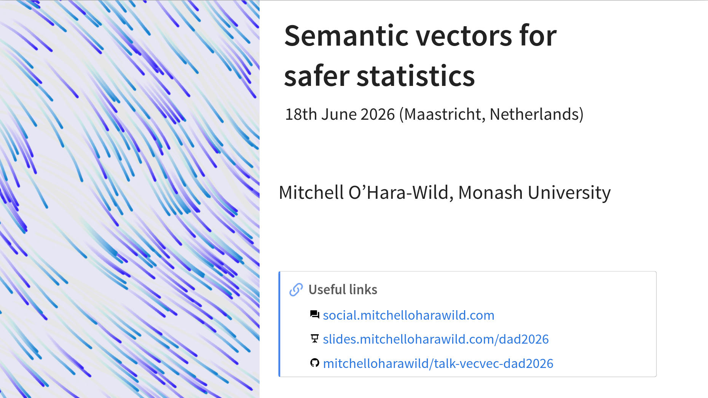

<!-- README.md is generated from README.qmd. Please edit that file -->

# Semantic vectors for safer statistics

<!-- badges: start -->

<!-- badges: end -->

Slides and notes for a presentation about vectorised statistics at useR!
2026 in Warsaw, Poland (July 2026).

<!-- A recording of this presentation is available on YouTube here: <https://youtu.be/qkt4QSJnLwY> -->

<!--  -->

#### Abstract

Statistical analysis on temporal, spatial, graph, and probabilistic data
is error-prone when the data types lack intrinsic structure. Outputs
from models typically return these composite data types separately,
requiring the user to assemble and apply the results correctly. This
reduces the accessibility of statistics and results in error-prone
analysis. Representing these data types using composite vector types
makes statistical operations and data analysis easier.

In this talk, I will introduce the application of vectorised statistical
operations across common dimensions not otherwise handled in traditional
data structures. The vectors of vectors data type implemented in the
vecvec R package is foundational for creating efficient mixed data
types. The distributional and mixtime R packages leverage vecvec in
order to create vectors that mix different distributions and temporal
granularities together. Storing distributions with different shapes and
parameterisations together in the same vector abstracts away the data
handling complexity while providing a user-friendly interface for
calculating distributional statistics such as the mean, quantiles, and
densities. Similarly, storing time at different granularities allows
combining data from different sources and facilitates forecasts across
multiple levels of temporal aggregation.

These semantic vectors combine naturally in tidy rectangular data to
facilitate statistically sensible multi-dimensional analysis. For
instance, pairing temporal and distributional vectors yields a dataset
ready for probabilistic time series forecasting, or pairing temporal and
spatial vectors a dataset ready for spatio-temporal analysis.

#### Structure

1.  R as a *vectorised* statistics language (see also ‘Keep R weird’)
2.  What are vectors (and what are *records*)? A brief introduction to
    the vctrs package.
3.  Semantic variables vectors (time, distribution, spatial, graph, …)
4.  Basics of distributional vectors (single distribution types).
5.  Mixed type vectors of vectors. A brief showcase of the vecvec
    package.
6.  Operations on semantic vectors with the distributional package.
7.  Other semantic vectors (mixtime, graphvec, sf).
8.  Combining semantic variables (distributional+mixtime == forecasts)

### Format

18 minutes (15 minute talk, 3 minute Q&A)
