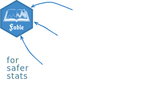
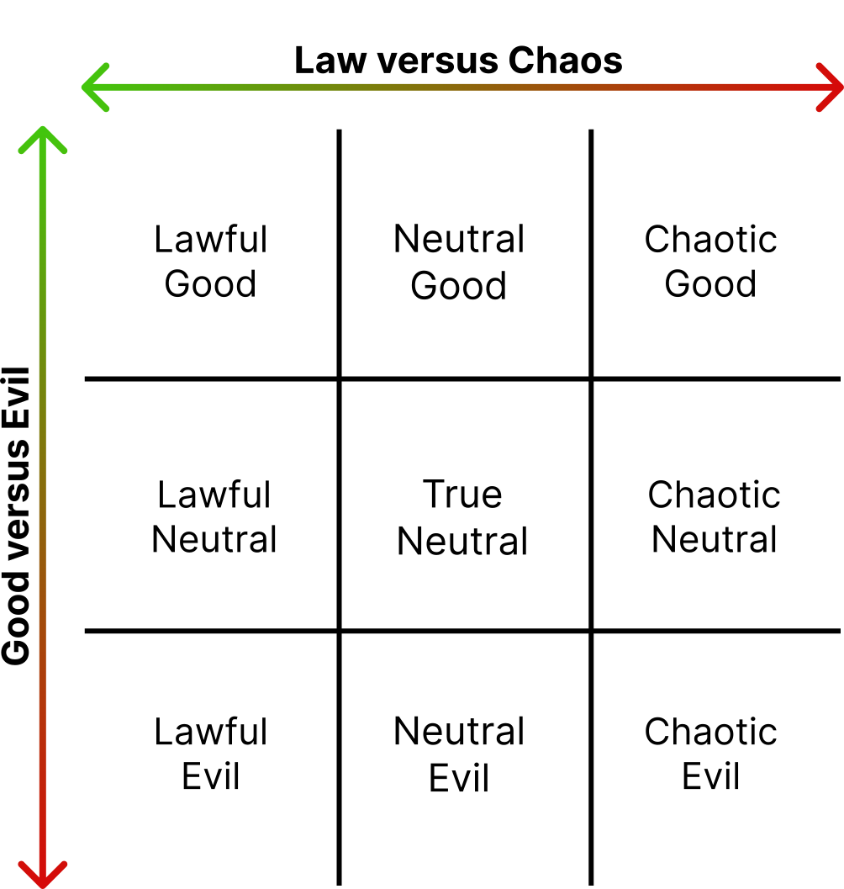
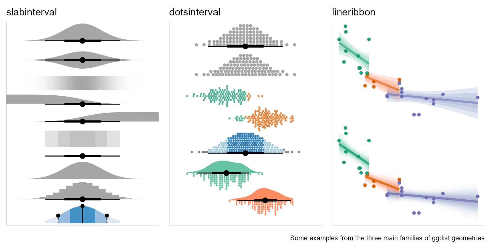
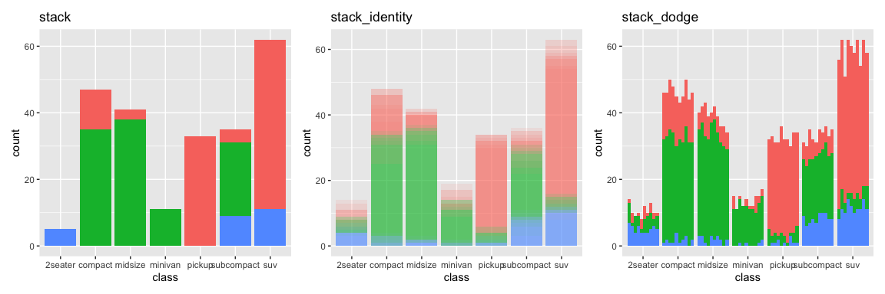
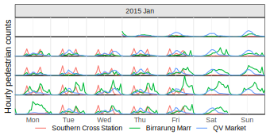
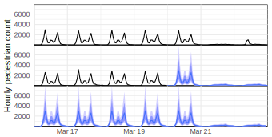

```{r}
#| label: setup
#| include: false
library(distributional)
```

## {background-iframe="backgrounds/vector-particles.html"}

::: columns
::: {.column width="37.5%"}

{style="margin-left:-35px;"}

:::
::: {.column width="60%"}

::: {.title data-id="title"}
Semantic vectors for  
safer statistics
:::

::: {.dateplace}
9th July 2026 @ useR! (Warsaw, Poland)
:::

<br>

Mitchell O'Hara-Wild, Monash University

<br><br>

::: {.callout-link}

## Useful links

{.icon} [social.mitchelloharawild.com](https://social.mitchelloharawild.com/)

{.icon} [slides.mitchelloharawild.com/user2026](https://slides.mitchelloharawild.com/user2026)

{.icon} [mitchelloharawild/talk-vecvec-user2026](https://github.com/mitchelloharawild/talk-vecvec-user2026)

:::

:::
:::

## {.center}


## {}

::: {.r-stack}
{.image-full}

{.image-full .fragment}

{.image-full .fragment}
:::


## {}

::: {.r-stack}
{.image-full}

{.image-full .fragment}

{.image-full .fragment}
:::


<!-- ## {}

::: columns

::: {.column width="40%"}
:::

::: {.column width="60%"}
### Vectorised statistics

::: {.fragment .fade-in}
Most programming languages require using **explicit loops** for statistics on vectors.

```c
// C code for a log transformation
double x[] = {1.0, 2.0, 3.0, 4.0, 5.0};
size_t n = sizeof(x) / sizeof(x[0]);

for (size_t i = 0; i < n; ++i) {
  x[i] = log(x[i]);
}
```
:::

::: {.fragment .fade-in}
Languages used for statistical computing have **vectorised operations** (implicit loops).

```{r}
#| echo: true

# R code for a log transformation
log(1:5)
```
:::

:::
:::

{.image-left}

## {}

::: columns

::: {.column width="60%"}
### What are vectors? (aka arrays)

::: {.fragment .fade-in}
A set of values with the same data type.
:::

::: {.fragment .fade-up}
::: {.callout-note icon="false"}
## ⚛️ Atomic vectors (aka primitive types)

Simple data types, such as:

* logical: `c(TRUE, FALSE)`
* integer: `c(1L, 2L, 3L)`
* double: `c(1.618, 3.14)`
* character: `c("a", "b", "c")`
:::
:::

::: {.fragment .fade-up}
::: {.callout-note icon=false}

## 🏗️ Classed vectors

Other data types are built from them, such as:

* Factor (integer: indexing levels)
* Date (double: days since 1970-01-01)

:::
:::

:::
:::

{.image-right} -->


## {}

::: columns
::: {.column width="65%"}

### Safer statistics with semantics

::: {.fragment}

Many data types have *intrinsic structure*, requiring special care in statistical analysis.

::: {.incremental style="font-size: 0.92em;"}
* :1234: ordinal: `ordered`, `{forcats}`

* :four_leaf_clover: uncertainty: `p/d/q/r`, `{distributional}`

* :hourglass: time: `Date`, `POSIXt`, `{hms}`, `{mixtime}`

* :spider_web: graph: `{igraph}`, `{tidygraph}`, `{graphvec}`

* :world_map: spatial: `{sp}`, `{sf}`
:::

:::
:::
:::

{.image-right}

## {}

::: columns
::: {.column width="62.5%"}

### Safer statistics with semantics

Statistical operations leverage their structure to prevent analysis that violate semantics.

```{r}
#| error: true
#| echo: true
Jan31 <- as.Date("2025-01-31")
Jan31 + 1
```

::: {.fragment}
```{r}
#| error: true
#| echo: true
Jan31 * 2
```
:::
::: {.fragment}
```{r}
#| error: true
#| echo: true
log(Jan31)
```

:::
::: {.fragment}
```{r}
#| error: true
#| echo: true
Jan31 + lubridate::period(1, "months")
```
:::


::: {.fragment}
```{r}
#| warning: true
#| echo: true
Sys.Date() + Sys.time()
```
:::


:::
:::

{.image-right}

<!-- TODO: Meta vecvec is distributional, mixtime, and graphvec slide -->

## {}

::: columns

::: {.column width="60%"}
### Unsafe Stats: R's distributions

The included distributions in R (and many extension packages) use p/d/q/r functions for statistical operations on distributions.

::: {.callout-note}
## The p/d/q/r functions

These functions allow you to calculate statistical operations from distributions:

* `p`: The 'probability' (CDF)
* `d`: The 'density' (PDF)
* `q`: The 'quantiles'
* `r`: The 'random' samples

Some packages also define `m` functions for moments!
:::


:::
:::

{.image-right}


## {}

::: columns

::: {.column width="60%"}
### Unsafe Stats: R's distributions


::: {.callout-note}
## Using p/d/q/r functions

These operation prefixes are used in conjunction with the distribution's shape. The general form is:

::: {style="font-family: monospace;"}
[\<op\>]{style="color: #B388EB;"}[\<shape\>]{style="color: #084887;"}([\<args\>]{style="color: #B388EB;"}, [\<parameters\>]{style="color: #8093f1;"})
:::

:::{.fragment .fade-in}
For example, the density ([**d**]{style="color: #B388EB;"}) at [**0.5**]{style="color: #B388EB;"} of a Normal ([**norm**]{style="color: #084887;"}) distribution with mean [**1**]{style="color: #8093f1;"} and standard deviation [**3**]{style="color: #8093f1;"} is:

::: {style="font-family: monospace;"}
[d]{style="color: #B388EB;"}[norm]{style="color: #084887;"}([q = 0.5]{style="color: #B388EB;"}, [mean = 1, sd = 3]{style="color: #8093f1;"})
:::

```{r}
dnorm(0.5, mean = 1, sd = 3)
```

:::

:::

::: {.fragment .fade-up}
::: {.callout-important}
## Semantics not included

These functions are very **error-prone** since users have the burden of performing valid distributional operations.
:::
:::

:::
:::

{.image-right}

## {}

::: columns

::: {.column width="60%"}
### Unsafe Stats: R's distributions

::: {.callout-warning}
## Short and confusing function names

The p/d/q/r functions need memorisation for each shape.

:::

::: {.callout-warning}
## Risky recycling

These p/d/q/r functions are **vectorised** and **fast** :tada:

[***How*** these functions vectorise inputs is surprising :ghost:]{.fragment .fade-in}

::: {.fragment .fade-in}
```{r}
#| echo: true
# 95% intervals from N(1,9)
qnorm(c(0.025, 0.975), mean = 1, sd = 3)
```
:::
::: {.fragment .fade-in}
```{r}
#| echo: true
# 2.5% from N(1,9) and 97.5% from N(1,16)
qnorm(c(0.025, 0.975), mean = 1, sd = c(3,4))
```
:::
::: {.fragment .fade-in}
```{r}
#| echo: true
# W̷͌͘h̵̕͘a̶̚͠t̷͘͠ ̷̈́͝i̴͠͠s̴͝͝ ̶̀̕h̷́͠á̶͝p̷͝͝p̴̀͝e̶͘͠n̷͝͝i̸̕͠n̵͝͠g̷̀͝ ̶́͠h̷́͠è̴͘ŕ̷͠e̵͝͝⸘
qnorm(c(0.025, 0.975), mean = c(1,2), sd = c(3,4,5))
```
:::

:::


:::
:::

{.image-right}

## {}

::: columns

::: {.column width="60%"}
### Unsafe Stats: R's distributions

::: {.callout-important}
## R's model prediction output

Worst of all: obtaining distributions from models.
:::

::: {.fragment .fade-up}
::: {.callout-note icon="false"}
## 🐧 Predicting penguins

Consider the output when using `predict()` on a `lm()` for the length of penguin bills using depth and species.

```{r}
#| echo: true
fit <- lm(
  bill_length_mm ~ species*bill_depth_mm, 
  data = palmerpenguins::penguins
)
predict(fit, tail(palmerpenguins::penguins))
```
:::
:::

::: {.fragment .fade-up}
::: {.callout-warning}
## Where's the uncertainty!

By default, predictions only return the expected value.
:::
:::

:::
:::

{.image-right}


## {}

::: columns

::: {.column width="60%"}
### Unsafe Stats: R's distributions

::: {.callout-tip}
## Finding uncertainty!

Use `se.fit = TRUE` in `predict()` to get standard errors.

```{r}
#| echo: true
predict(fit, tail(palmerpenguins::penguins), 
        se.fit = TRUE)
```

:::
:::
:::

{.image-right}


## {}

::: columns

::: {.column width="60%"}
### Unsafe Stats: R's distributions

::: {.callout-caution}
## Time to compute intervals!

(as a naive first-year stats student)

```{r}
#| echo: true
#| eval: false
pred <- predict(fit, tail(palmerpenguins::penguins), se.fit = TRUE)
sprintf(
  "[%f, %f]95",
  qnorm(0.025, mean = pred$fit, pred$se.fit),
  qnorm(0.975, mean = pred$fit, pred$se.fit)
)
```

```{r}
pred <- predict(fit, tail(palmerpenguins::penguins), se.fit = TRUE)
cat(sprintf(
  "[%f, %f]95",
  qnorm(0.025, mean = pred$fit, pred$se.fit),
  qnorm(0.975, mean = pred$fit, pred$se.fit)
), sep = "\n")
```

:::
:::
:::

{.image-right}


## {}

::: columns

::: {.column width="60%"}

### Unsafe Stats: R's distributions

Here's the code to obtain 95\% prediction intervals for the penguins data:

```{r}
#| echo: true
#| eval: false
pred <- predict(fit, tail(palmerpenguins::penguins), se.fit = TRUE)
sprintf(
  "[%f, %f]95",
  pred$fit + qt(0.025, df = pred$df) * pred$se.fit,
  pred$fit + qt(0.975, df = pred$df) * pred$se.fit
)
```


```{r}
pred <- predict(fit, tail(palmerpenguins::penguins), se.fit = TRUE)
cat(sprintf(
  "[%f, %f]95",
  pred$fit + qt(0.025, df = pred$df) * pred$se.fit,
  pred$fit + qt(0.975, df = pred$df) * pred$se.fit
), sep = "\n")
```

:::{.fragment .fade-in}
:::{.callout-important}
## Not quite right

The above calculations are for **confidence intervals**, not prediction intervals! Did you notice?
:::
:::
:::
:::

{.image-right}


## {}

::: columns

::: {.column width="60%"}

### Unsafe Stats: R's distributions


The correct code for **prediction intervals** is:

```{r}
#| echo: true
#| eval: false
pred <- predict(fit, tail(palmerpenguins::penguins), se.fit = TRUE)
sprintf(
  "[%f, %f]95",
  pred$fit + qt(0.025, df = pred$df) * sqrt(pred$se.fit^2 + pred$residual.scale^2),
  pred$fit + qt(0.975, df = pred$df) * sqrt(pred$se.fit^2 + pred$residual.scale^2)
)
```


```{r}
pred <- predict(fit, tail(palmerpenguins::penguins), se.fit = TRUE)
cat(sprintf(
  "[%f, %f]95",
  pred$fit + qt(0.025, df = pred$df) * sqrt(pred$se.fit^2 + pred$residual.scale^2),
  pred$fit + qt(0.975, df = pred$df) * sqrt(pred$se.fit^2 + pred$residual.scale^2)
), sep = "\n")
```

:::{.fragment .fade-up}
:::{.callout-important}
## Error-prone analysis

There's a lot to know about regression, distributions, and R functions to get correct prediction intervals. 

It's easy to make mistakes (or ignore uncertainty).
:::
:::

:::
:::

{.image-right}

## {}

::: columns

::: {.column width="60%"}

### A better alternative?

:::{.fragment .fade-in}

What if model predictions could directly produce a vector of distributions?

```{r}
library(distributional)
options(width = 60)
pred <- dist_student_t(
  df = pred$df,
  mu = pred$fit,
  sigma = sqrt(pred$se.fit^2 + pred$residual.scale^2)
)
```

```r
# Hypothetical predict() method for lm()
pred <- predict(fit, tail(palmerpenguins::penguins))
pred
```

```{r}
pred
```

:::

::: {.fragment .fade-in}
```{r}
#| echo: true
hilo(pred, 95)
```
:::

:::
:::

{.image-right}

## {}

::: columns
::: {.column width="62.5%"}

### Making better distributions

{.sticker-float-midright}

`{vctrs}` offers two vector types:

::: {.callout-tip icon="false"}
## 🏷️ Vectors: `new_vctr()`

Vectors add attributes to existing vector types.

e.g. `POSIXct` is the seconds since 1970-01-01.

```{r}
#| echo: true
unclass(as.POSIXct("2025-12-04 11:00:00")) 
```
:::

::: {.fragment .fade-in}

This enables single-parameter distributions:

```{r}
#| echo: true
library(distributional)
dist_poisson(c(4, 2, 6))
```
:::

::: {.fragment .fade-in}
What about multi-parameter distributions?
:::

:::
:::

{.image-right}

## {.fragment-remove}

::: columns
::: {.column width="62.5%"}

### Making better distributions

{.sticker-float-midright}

`{vctrs}` offers two vector types:

::: {.callout-tip icon="false"}
## 💿 Records: `new_rcrd()`

Records use information from multiple vectors (of same length).

e.g. `POSIXlt` contains the parts of a datetime.

::: {.fragment .fade-out fragment-index="1"}
```{r}
#| echo: true
unclass(as.POSIXlt("2025-12-04 11:00:00")) |> str()
```
:::
:::


::: {.fragment .fade-up fragment-index="1"}
This enables multi-parameter distributions:

```{r}
#| echo: true
library(distributional)
dist_normal(mu = c(1, 3, -1), sigma = c(3, 2, 4))
```
:::

::: {.fragment .fade-up fragment-index="2"}
How can different shaped distributions coexist within the same vector? [**That's trickier!**]{.fragment .fade-in}
:::

:::
:::

{.image-right}

## {}

::: columns
::: {.column width="62.5%"}

### Mixed-type vectors

{.sticker-float-midright}

`{vecvec}` creates vectors of vectors:

::: {.callout-tip icon="false"}
## 🧬 vecvec: `vecvec()`

These vectors mix different vector types together.

```{r}
#| echo: true
library(vecvec)
vecvec(c(1,2), c("a","b"), c(TRUE, FALSE))
```
:::

::: {.fragment .fade-up}
::: {.callout-important icon="false"}
## 🛑 A *bad* idea

Almost always, this causes more problems than it solves.

:::
:::

:::
:::

{.image-right}

## {}

::: columns
::: {.column width="62.5%"}

### Mixed-type vectors

{.sticker-float-midright}

These vectors are essentially clever  
indexing of vectors in lists.

::: {.callout-tip icon="false"}
## 🔍 The `str`ucture of vecvec

Conceptually similar to `factor()` but indexed over list values.

```{r}
#| echo: true
library(vecvec)
str(
  vecvec(c(1,2), c("a","b"), c(TRUE, FALSE))
)
```
:::

:::
:::

{.image-right}


## {}

::: columns
::: {.column width="62.5%"}

### Mixed-type *arrays*

{.sticker-float-midright}

The shape (dimensions) of the indices  
are the shape of the `vecvec` vector.

::: {.callout-tip icon="false"}
## 🔢 Multi-dimensional

Unlike many data types, `vecvec` can be matrices or arrays.

```{r}
#| echo: true
library(vecvec)
array(
  vecvec(c(1,2), c("a","b"), c(TRUE, FALSE)),
  dim = c(3, 2)
)
```
:::

:::
:::

{.image-right}


## {}

::: columns
::: {.column width="62.5%"}

### Mixed-type operations

{.sticker-float-midright}

Operations apply to each component   
vector (fast and vectorised).

::: {.callout-tip icon="false"}
## 📐 Analysis across vectors

```{r}
#| echo: true
library(vecvec)
vecvec(c(1,2), c("a","b"), c(TRUE, FALSE)) == 1L
```
:::

::: {.fragment .fade-up}
::: {.callout-note icon="false"}
## ♻️ Recycling and casting

Operations respect safe recycling rules.

Casting rules match underlying vector types.
:::
:::

:::
:::

{.image-right}


## {}

::: columns
::: {.column width="62.5%"}

### Mixed-type manipulation

{.sticker-float-midright}

```{r}
#| echo: true
library(tidyr)
household
```

:::
:::

{.image-right}


## {}

::: columns
::: {.column width="62.5%"}

### Mixed-type manipulation

{.sticker-float-midright}

```{r}
#| echo: true
library(tidyr)
household |> 
  pivot_longer(
    everything(), 
    values_transform = vecvec::vecvec
  )
```

::: {.fragment}
```{=html}
<video width="680px" style="position: absolute; right: -30px; bottom: 0;" muted loop>
  <source src="media/elmo.webm" type="video/webm">
</video>
```
:::


:::
:::

{.image-right}

## {}

{fig-align="center"}

## {}

{fig-align="center"}

## {}

{fig-align="center"}

## {}

{fig-align="center"}

## {}

{fig-align="center"}


## {.fragment-remove}

::: columns
::: {.column width="62.5%"}

### Mixed-type *semantic* vectors

`{vecvec}` is perhaps only useful for mixed-type vectors that share **common semantics**.

<br>

Suitable semantic data-types include:

[📊 **Distributional** (different shapes)]{.fragment}

[📅 **Temporal** (different chronons / calendars)]{.fragment}

[🗺️ **Spatial** (different geometries)]{.fragment}

[🗳️ **Preferential** (different candidates)]{.fragment}

:::
:::

{.image-right}


## {.fragment-remove}

::: columns
::: {.column width="62.5%"}

### Mixed-type *semantic* vectors

{.sticker-float-midright .fragment fragment-index="1"}

::: {.fragment .fade-out fragment-index="2"}
`{vecvec}` allows us to efficiently  
combine distributions of **different shape**.
:::

::: {.fragment fragment-index="1"}
::: {.callout-tip icon="false"}

## 📊 Mixed distributions

Putting it all together...

```{r}
#| echo: true
library(distributional)
dist <- c(
  dist_poisson(c(4, 2, 6)),
  dist_normal(mu = c(1, 3, -1), sigma = c(3, 2, 4))
)
dist
```
:::
:::

::: {.fragment .fade-up fragment-index="2"}
::: {.callout-tip icon="false"}
## 🧮 Vectorised statistics across distributions

Since distributions share common semantics, we can apply statistical operations across them.

```{r}
#| echo: true
density(dist, at = 1)
```


:::
:::

:::
:::

{.image-right}

## {}

::: columns
::: {.column width="37.5%"}
:::

::: {.column width="60%"}
### Better distributions for R

The **distributional** package makes it simpler to create and use distributions in R.

::: {.callout-tip}
## Creating distributions

All distributions in the package start with `dist_*()`.

```{r}
#| echo: true
dist <- c(
  dist_poisson(c(4, 2, 6)),
  dist_normal(mu = c(1, 3, -1), sigma = c(3, 2, 4))
)
```

The package currently provides:

* 25 continuous distributions,
* 9 discrete distributions,
* p/d/q/r distributions via `dist_wrap()`,
* sample, degenerate and percentile distributions.

:::
:::
:::

{.image-left}

## {}

::: columns
::: {.column width="37.5%"}
:::

::: {.column width="60%"}
### Vectorised distribution statistics

The p/d/q/r functions have more descriptive alternatives:

* `p`->`cdf()`: The CDF
* `d`->`density()`: The density (PDF)
* `q`->`quantile()`: The quantile
* `r`->`generate()`: Random samples 

::: {.callout-tip}
## Distributional operations

These functions are the same for any distribution.
:::


:::
:::

{.image-left}

## {}

::: columns
::: {.column width="37.5%"}
:::

::: {.column width="60%"}
### Vectorised distribution statistics

::: {.callout-tip}
## Other operations

There are many more statistics than p/d/q/r.

* `log_likelihood()`/`likelihood()`
* `hilo()`
* `hdr()`
* `support()`
* `mean()`
* `variance()`/`covariance()`
* `skewness()`
* `kurtosis()`
:::
:::
:::

{.image-left}


## {}

::: columns
::: {.column width="37.5%"}
:::

::: {.column width="60%"}
### Vectorised distribution statistics

Use distribution vectors in data frames!

```{r}
#| echo: true
library(dplyr)
tibble(
  dist = c(
    dist_poisson(c(4, 2, 6)),
    dist_normal(mu = c(1, 3, -1), sigma = c(3, 2, 4))
  )
)
```
:::
:::

{.image-left}


## {}

::: columns
::: {.column width="37.5%"}
:::

::: {.column width="60%"}
### Vectorised distribution statistics

Perform statistics alongside distributions.

```{r}
#| cache: false
options(width = 120)
library(distributional)
```

```{r}
#| echo: true
#| cache: false
library(dplyr)
tibble(
  dist = c(
    dist_poisson(c(4, 2, 6)),
    dist_normal(mu = c(1, 3, -1), sigma = c(3, 2, 4))
  )
) |> 
  mutate(
    mean = mean(dist), var = variance(dist),
    pdf = density(dist, 1), cdf = cdf(dist, 1)
  )
```
:::
:::

{.image-left}

## {.fragment-remove}

::: columns
::: {.column width="37.5%"}
:::

::: {.column width="60%"}
### Mixed-type semantic vectors

:::{.pkg}
::: {.fragment .fade-out fragment-index="0"}

:::

🎲 Probabilistic

::: {.fragment .fade-out fragment-index="0"}
```{r}
#| echo: TRUE
library(distributional)
c(dist_normal(1, 2), dist_poisson(3))
```
:::
:::

::: {.fragment .fade-up fragment-index="0"}
:::{.pkg}
::: {.fragment .fade-out fragment-index="1"}

:::

📅 Temporal

::: {.fragment .fade-out fragment-index="1"}
```{r}
#| echo: TRUE
library(mixtime)
today <- Sys.Date()
c(year(today), yearquarter(today), yearmonth(today))
```
:::
:::
:::


::: {.fragment .fade-up fragment-index="1"}
:::{.pkg}
::: {.fragment .fade-out fragment-index="2"}

:::

🗺️ Spatial

::: {.fragment .fade-out fragment-index="2"}
```r
library(sf)
c(st_point(c(1, 1)), st_linestring(rbind(c(1, 1),c(2, 2),c(3, 1))), st_polygon(list(rbind(c(0, 0), c(4, 0), c(4, 4), c(0, 4), c(0, 0)))))
```
```{r}
library(sf) 
st_sfc(st_point(c(1, 1)), st_linestring(rbind(c(1, 1),c(2, 2),c(3, 1))), st_polygon(list(rbind(c(0, 0), c(4, 0), c(4, 4), c(0, 4), c(0, 0)))), crs = 4326)
```
:::
:::
:::

::: {.fragment .fade-up fragment-index="2"}
:::{.pkg}
::: {.fragment .fade-out fragment-index="3"}

:::

🗳️ Preferential


::: {.fragment .fade-out fragment-index="3"}
```r
library(prefio)
read_preflib("00004 - netflix/00004-00000138.soc", from_preflib = TRUE)
```

```{r}
library(prefio)
read_preflib("00004 - netflix/00004-00000138.soc", from_preflib = TRUE)[[1]][1:3]
```
:::
:::
:::

::: {.fragment .fade-up fragment-index="3"}
:::{.pkg}
🕸️ Graph


```{r}
#| echo: true
library(graphvec)
edge_vec(from = c(1L, 2L, 1L), to = c(2L, 3L, 3L), nodes = data.frame(id = 1:3, label = c("A", "B", "C")))
```
:::
:::

:::
:::

{.image-left}


## {}

::: columns
::: {.column width="37.5%"}
:::

::: {.column width="60%"}
### Combining semantic vectors

::: {.incremental}
* 🔮📅 Forecasting: 

  `{mixtime}` + `{distributional}`
* 🗺️📅 Spatio-temporal data: 

  `{sf}` + `{mixtime}`
* 🕸️📊 Network modelling: 

  `{graphvec}` + `{distributional}`
* 🔮🗺️📅🕸️ 

  Probabilistic-spatio-temporal-graph:

  `{distributional}` + `{sf}` +  
  `{mixtime}` + `{graphvec}`
:::

:::
:::

{.image-left}


## {}

::: columns
::: {.column width="37.5%"}
:::

::: {.column width="60%"}
### Combining semantic vectors

{.sticker-float-right}

Forecasts from `{fable}` combines `{mixtime}` and `{distributional}` vectors.

```r
library(fable)
sunspots_tsbl |> 
  model(ARIMA(value)) |> 
  forecast(h = "10 years")
```

```{r}
#| cache: false
library(fable)
as_tsibble(sunspot.year) |> 
  mutate(index = mixtime::year(as.integer(index))) |>
  model(ARIMA(value)) |> 
  forecast(h = "10 years")
```


:::
:::

{.image-left}


## {}

::: columns


::: {.column width="40%"}
:::
::: {.column width="60%"}
### Visualising distributions

The [{ggdist}](https://mjskay.github.io/ggdist/) and [{ggdibbler}](https://harriet-mason.github.io/ggdibbler/) packages extend `{ggplot2}` with distributional graphics.

{.sticker-float-right style="top:160px;"}


:::
:::

{.image-left}


## {}

::: columns


::: {.column width="40%"}
:::
::: {.column width="60%"}
### Visualising distributions

The [{ggdist}](https://mjskay.github.io/ggdist/) and [{ggdibbler}](https://harriet-mason.github.io/ggdibbler/) packages extend `{ggplot2}` with distributional graphics.

<br><br>

{.sticker-float-right style="top:160px;"}


:::
:::

{.image-left}


## {}

::: columns


::: {.column width="40%"}
:::
::: {.column width="60%"}
### Visualising time

The [{ggtime}](https://pkg.mitchelloharawild.com/ggtime/) package extends `{ggplot2}` with temporal graphics.

<br>

{.sticker-float-right style="top:160px;"}
{style="width:100%"}

:::
:::

{.image-left}


## {}

::: columns


::: {.column width="40%"}
:::
::: {.column width="60%"}
### Visualising forecasts

Combining [{ggtime}](https://pkg.mitchelloharawild.com/ggtime/) and [{ggdist}](https://mjskay.github.io/ggdist/) enables flexible forecast visualisation.

<br>

{.sticker-float-right style="top:160px;"}
{.sticker-float-right style="top:160px;right:116px;"}
{style="width:100%"}

:::
:::

{.image-left}


<!-- 
## {}

::: columns
::: {.column width="60%"}
### Open Question

::: {.callout-important}
## Comparing statistics with multivariate distributions

Imagine we make predictions with a univariate and multivariate model.

```{r}
joint <- dist_multivariate_normal(mu = list(c(1, 2)), sigma = list(matrix(c(1, 0.5, 0.5, 1), nrow = 2)))
joint

marginal <- dist_normal(mu = c(1, 2), sigma = c(1, 2))
marginal
```

It is complex to compare outputs across univariate and multivariate distributions.
:::

::: {.callout-note}
## vecvec structure

A 'vecvec' is a list of vectors.  

Each list occupies many values in the 'flat' vector.

The 'width' of each list is given by `lengths()`.
:::


Is it sensible to 'vecvec' other things?

Joint distributions? Global models?

```{r}
library(distributional)
joint <- dist_multivariate_normal(
  mu = list(c(1, 2, 3)),
  sigma = list(matrix(c(1, 0.5, 0.5, 0.5, 1, 0.5, 0.5, 0.5, 1), nrow = 3))
)
marginal <- dist_normal(
  mu = c(1, 2, 3), 
  sigma = c(1, 2, 3)
)
marginal
joint
```

:::
:::

{.image-right}
-->


## Thanks for your time!

::: columns
::: {.column width="60%"}

::: {.callout-tip}
## Final remarks

::: incremental

* 📊 Strict semantics supports safer statistics.
* ♾️ Endless combinations for stats and data viz.
* 🧑‍💻 Vectorised code 🤝 statistical analysis.
* 💭 Can 'vecvec' style solutions solve other problems?

:::

:::

::: {.callout-link}

## Useful links

{.icon} [social.mitchelloharawild.com](https://social.mitchelloharawild.com/)

{.icon} [slides.mitchelloharawild.com/user2026](https://slides.mitchelloharawild.com/user2026)

{.icon} [mitchelloharawild/talk-vecvec-user2026](https://github.com/mitchelloharawild/talk-vecvec-user2026)

:::

:::
:::

{.image-right}

<!-- ## Unsplash credits

::: {.callout-unsplash}

## Thanks to these Unsplash contributors for their photos

```r
#| echo: FALSE
#| cache: TRUE
library(httr)
library(purrr)
unsplash_pattern <- ".*-(.{11})-unsplash\\.jpg.*"
slides <- readLines("index.qmd")
backgrounds <- slides[grepl("backgrounds/.+?unsplash.jpg", slides)]
images <- unique(sub(".*\\(backgrounds/(.+?)\\).*", "\\1", backgrounds))
images <- images[grepl(unsplash_pattern, images)]
ids <- sub(unsplash_pattern, "\\1", images)

get_unsplash_credit <- function(id) {
  unsplash_url <- "https://api.unsplash.com/" 
  my_response <- httr::GET(unsplash_url, path = c("photos", id), query = list(client_id=Sys.getenv("UNSPLASH_ACCESS")))
  xml <- content(my_response)
  
  name <- xml$user$name
  desc <- xml$description%||%"Photo"
  sprintf(
    "* %s: [%s%s](%s)",
    name,
    strtrim(desc,60-nchar(name)),
    if(nchar(desc)>(60-nchar(name))) "..." else "",
    modify_url("https://unsplash.com/", path = file.path("photos", xml$id))
  )
}
htmltools::includeMarkdown(paste0(map_chr(ids, get_unsplash_credit), collapse = "\n"))
```

::: -->

## {.center}

[🎉 Bonus Slides 🎉]{.r-fit-text}


## {}

::: columns

::: {.column width="60%"}
### Modifying distributions

Distributions can be transformed using mathematical operations.

```{r}
#| echo: true
dist_normal(1,3)
```

::: {.fragment .fade-in}
```{r}
#| echo: true
2 + dist_normal(1,3)
```
:::
::: {.fragment .fade-in}

```{r}
#| echo: true
3 * (2 + dist_normal(1,3))
```

:::
::: {.fragment .fade-in}

```{r}
#| echo: true
exp(3 * (2 + dist_normal(1,3)))
```

:::

:::
:::

{.image-right}

## {}

::: columns

::: {.column width="60%"}
### Modifying distributions

::: {.callout-note}
## Transformed distribution

`dist_transformed()` enables arbitrary transformations.

```{r}
#| echo: true
(3 * (2 + dist_normal(1,3)))^2
```
:::

::: {.fragment .fade-up}
::: {.callout-tip}
## Other distribution modifiers

🎈 `dist_inflated()`

✂️ `dist_truncated()`

🥣 `dist_mixture()`
:::
:::

:::
:::

{.image-right}


## {}

::: columns

::: {.column width="60%"}
### Vectorised operations

Vectorised operations in distributional are safer than the p/d/q/r equivalents.

::: {.callout-note}
## Vectorising in two ways

There are two types of operation arguments:

* `vector`/`matrix` inputs

  Vectorises across distributions, then arguments.
  
  This approach is **simpler**, especially single arguments.
  
* `list`/`data.frame` inputs

  Vectorises across arguments, then distributions.
  
  This approach is **more flexible and powerful**.
:::


:::
:::

{.image-right}


## {}

::: columns

::: {.column width="60%"}
### Vectorised operations (vectors)

```{r}
#| echo: true
(y <- c(dist_normal(0, 1), dist_beta(5, 1), dist_gamma(2, 1)))
```

Vectors/matrices apply the same operation inputs to each distribution.

```{r}
#| echo: true
density(y, at = 0.65)
density(y, at = c(0.65, 0.9))
```


:::
:::

{.image-right}

## {}

::: columns

::: {.column width="60%"}
### Vectorised operations (vectors)

::: {.callout-note}
## Distributions in data analysis

This also works well with data frames.

```{r}
#| echo: true
tibble::tibble(y) |> 
  dplyr::mutate(density(y, at = 0.65))
```

:::{.fragment .fade-in}
Although its a bit tricky for more than one input.

```{r}
#| echo: true
tibble::tibble(y) |> 
  dplyr::mutate(density(y, at = c(0.65, 0.9)))
```
:::
:::

:::
:::

{.image-right}


## {}

::: columns

::: {.column width="60%"}
### Vectorised operations (lists)

```{r}
#| echo: true
(y <- c(dist_normal(0, 1), dist_beta(5, 1), dist_gamma(2, 1)))
```

Lists/data.frames recycle each input argument to the length of distributions.

```{r}
#| echo: true
density(y, at = list(d1 = 0.65))
density(y, at = list(d1 = 0.65, d2 = 0.9))
```

:::
:::

{.image-right}

## {}

::: columns

::: {.column width="60%"}
### Vectorised operations (lists)

```{r}
#| echo: true
(y <- c(dist_normal(0, 1), dist_beta(5, 1), dist_gamma(2, 1)))
```

This also allows vectorisation across both inputs and distributions.

```{r}
#| echo: true
density(y, at = list(dens = c(0.65, 0.9, 0.3)))
```

::: {.fragment .fade-in}
::: {.callout-tip}
## Reliable recycling

```{r}
#| echo: true
#| error: true
density(y, list(dens = c(0.65, 0.9)))
```

:::
:::

:::
:::

{.image-right}


## {}

::: columns

::: {.column width="60%"}
### Vectorised operations (lists)

::: {.callout-note}
## Distributions in data analysis

This also works *really* well with data frames.

```{r}
#| echo: true
tibble::tibble(y) |> 
  dplyr::mutate(density(y, at = list(d1 = 0.65)))
```

:::{.fragment .fade-in}
`mutate()` automatically unpacks the results if unnamed.

```{r}
#| echo: true
tibble::tibble(y) |> 
  dplyr::mutate(
    density(y, at = list(d1 = 0.65, d2 = 0.9))
  )
```
:::
:::

:::
:::

{.image-right}


## {}

::: columns


::: {.column width="40%"}
:::
::: {.column width="60%"}
### Visualising distributions

```{r}
#| echo: true
library(ggdist)
library(ggplot2)
df <- tibble::tibble(
  name = c("Gamma(2,1)", "Normal(5,1)", "Mixture"),
  dist = c(dist_gamma(2,1), dist_normal(5,1),
           dist_mixture(dist_gamma(2,1), dist_normal(5, 1), weights = c(0.4, 0.6)))
)
ggplot(df, aes(y = factor(name, levels = rev(name)))) +
  stat_dist_halfeye(aes(dist = dist)) + 
  labs(title = "Density function for a mixture of distributions", y = NULL, x = NULL)
```


:::
:::

{.image-left}
